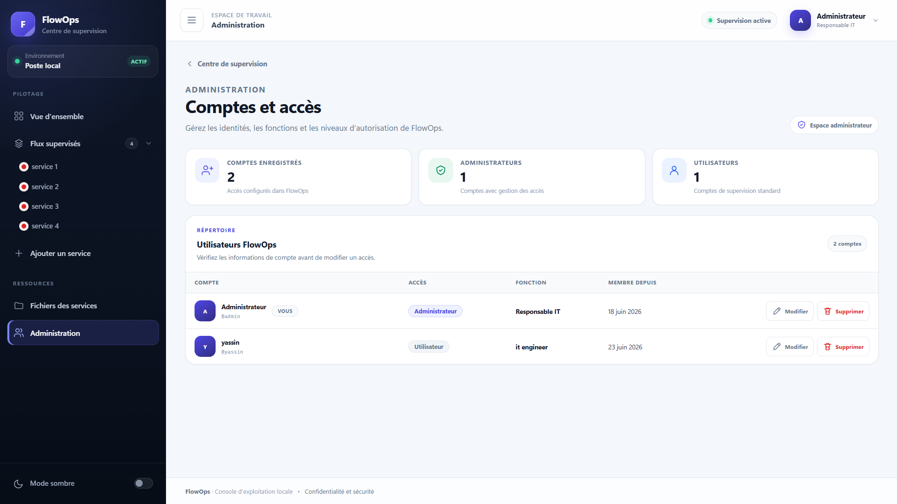
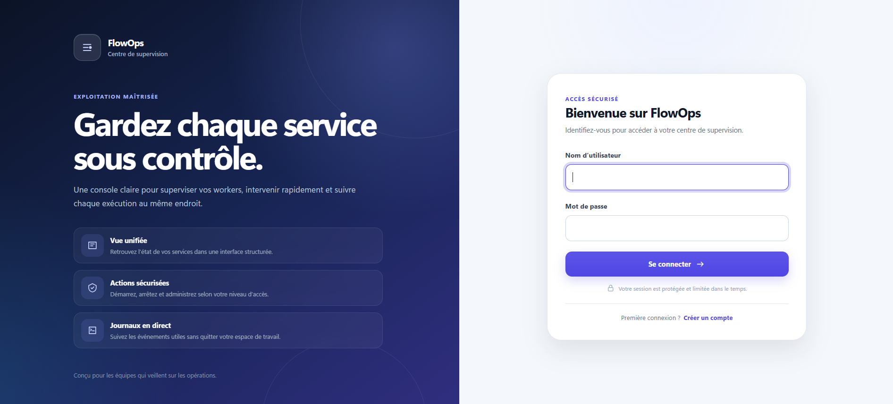
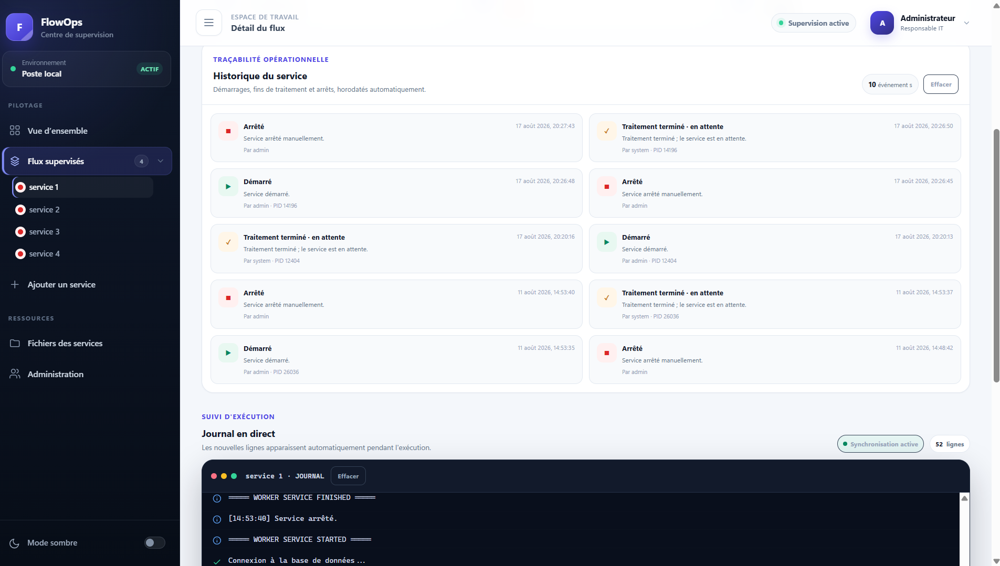

# FlowOps

FlowOps is an ASP.NET Core MVC application developed during my internship.

It provides a web interface for monitoring and managing Windows Worker Services.

## Features

- Start and stop worker services
- Monitor running services
- View live logs
- View service history
- Edit service configuration
- Browse deployed service files
- Register new services
- Track process IDs

## Technologies

- ASP.NET Core MVC
- .NET 8
- C#
- HTML
- CSS
- JavaScript
- JSON / JSONL
- Windows Task Scheduler

## Project Structure

The application uses ASP.NET Core MVC.

Service data, users, history, and process information are stored using JSON and JSONL files.

Windows processes are launched and managed through Windows Task Scheduler.

## Screenshots

### Dashboard

### Service Management

### Live Logs

## Author

Yassin Jendoubi